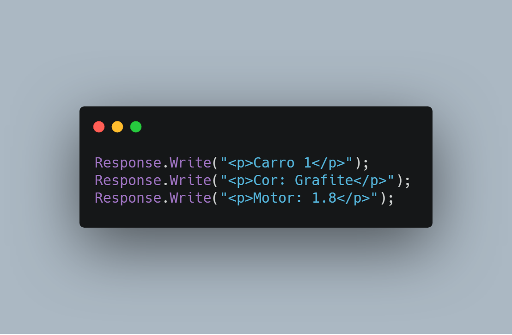
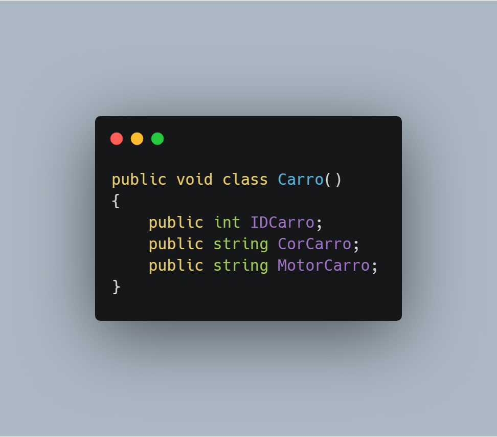
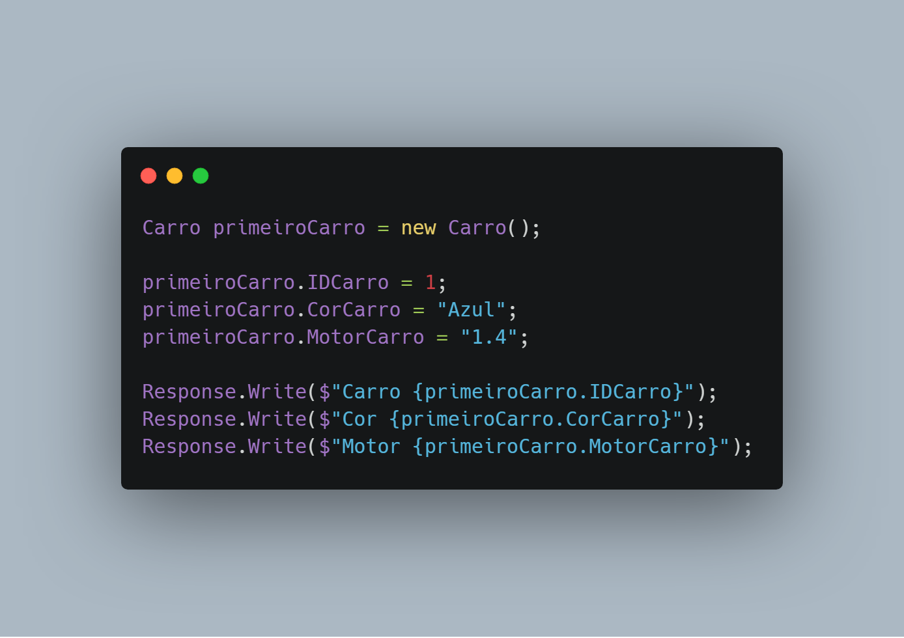

## Classes em C#

O paradigma de [Programação Orientada a Objetos](https://pt.wikipedia.org/wiki/Orienta%C3%A7%C3%A3o_a_objetos) traz com ele alguns conceitos, como o de classes.

## O que são?

Uma classe serve para economizar seu tempo.
Então quando você vai fazer algo que você vai precisar usar mais vezes, você pode utilizar classes.

Por exemplo, vou fazer um programa que mostre para o usuário informações sobre vários carros.

Um jeito "errado" de fazer isso seria:

Mas, e caso eu tivesse 100 carros? Teria que fazer isso para TODOS os 100 carros??

Bem, para ser mais pratico, podemos utilizar classes para isso!

## Criando classes!

Bem, primeiro de tudo, vamos ao Visual Studio, clicando com o botão direito do mouse em cima do projeto, vamos em adicionar e clicamos em "Classe"

Colocamos um nome a classe, e lembrando que a primeira letra é maiúscula por padrão.
 
Um exemplo de classe, é a seguinte:

Neste caso, criei um **classe pública** do tipo **void** (que não possui retorno; ou seja, não poderia usar: return ), e nela inseri alguns atributos, como ID, Cor e Motor
Percebe-se que utilizei a **letra maiúscula** no nome da classe e nos atributos, isso foi definido por convenção

OK! Classe criada, mas ainda não mostrei os valores para o usuário, apenas simplifiquei os carros.

Então, o código do formulário da web ficaria próximo disso:

Já parece algo mais "profissional" nosso código né?
O **$** antes das " " no *Response.Write* é para nós realizar a formatação do texto para inserir variáveis com mais facilidade.

Agora, se tivermos 100 carros, só precisamos definir 3 coisas. Os atributos deles, o código no formulário da web, basicamente é só copiar :)

